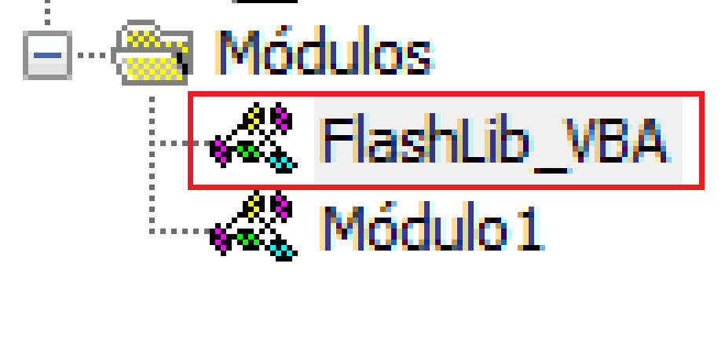

# FlashLib-VBA
Biblioteca com métodos prontos para a linguagem VBA

## Como usar?
Clone ou baixe o repositório e abra o arquivo "index.xlsx", basta construir seus códigos em cima deste mesmo arquivo.

## Como Funciona?
Para ver os métodos disponíveis, entre na aba de códigos e veja o módulo "FlashLibVB".

Estas funções são públicas, podem ser acessadas dos códigos de qualquer outro lugar do VB, formulários, outros módulos e etc.

## O que as funções fazem?
### Is Between?
```vb
isBetween(3, 5, 8)
'Retorna Verdadeiro!
```
A função isBetween checa se um número está entre outros dois números, no nosso exemplo, estamos verificando se 5 está entre 3 e 8.
Essa função pode ser usada dentro dos Ifs para evitar escritas condicionais gigantes:
```vb
If(isBetween(3, 2, 8))then
  MsgBox "Isso é verdadeiro!"
  Else
    MsgBox "Isso é falso!"
end if
'Escreve "Isso é falso!"
```
No exemplo a cima, como 2 não está entre 3 e 8, ele escreve falso na MsgBox.

### is From To?
```vb
isBetween(3, 3, 8)
'Retorna Verdadeiro!
```
Funciona da mesma forma que o isBetween, checa se um número está entre dois números, mas dessa vez considerando eles mesmos. 3 está entre 3 e 8, considerando também o número 3 e 8.

### Write and Break
```vb
s = Array("Olá", "tudo bem?", "Que horas são?")
MsgBox writeBreak(s)

'Escreve na msgbox
'Olá
'Tudo bem?
'Que horas são?
```
Como o nome ja diz, ele escreve e quebra a linha, ao criarmos um array de string, a cada elemento, ou seja, a cada vírgula, o programa quebrará uma linha na MsgBox, facilitando a forma de escrever no MsgBox de saída de dados sem precisar ficar escrevendo VBCRLF e concatenando 429174 coisas.
